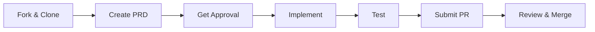

Thank you for your interest in contributing to MSP Claude Plugins! This guide walks you through the contribution workflow from start to finish.

## Contribution Workflow Overview



## Step 1: Fork and Clone

### Fork the Repository

1. Navigate to the [MSP Claude Plugins repository](https://github.com/wyre-engineering/msp-claude-plugins)
2. Click the **Fork** button in the top-right corner
3. Select your GitHub account as the destination

### Clone Your Fork

```bash
# Clone your fork
git clone https://github.com/YOUR-USERNAME/msp-claude-plugins.git
cd msp-claude-plugins

# Add upstream remote
git remote add upstream https://github.com/wyre-engineering/msp-claude-plugins.git

# Verify remotes
git remote -v
```

### Keep Your Fork Updated

```bash
# Fetch upstream changes
git fetch upstream

# Merge upstream main into your local main
git checkout main
git merge upstream/main

# Push updates to your fork
git push origin main
```

## Step 2: Create a Feature Branch

Use a descriptive branch name following this convention:

| Type | Pattern | Example |
|------|---------|---------|
| New Plugin | `plugin/<vendor>-<feature>` | `plugin/connectwise-tickets` |
| New Command | `command/<plugin>-<action>` | `command/autotask-create-ticket` |
| Documentation | `docs/<topic>` | `docs/autotask-setup` |
| Bug Fix | `fix/<description>` | `fix/ticket-search-pagination` |

```bash
git checkout -b plugin/connectwise-tickets
```

## Step 3: Create a PRD (Required for New Features)

Before implementing any new plugin or significant feature, you must create a Product Requirements Document (PRD).

### PRD Location

Create your PRD in the `prds/` directory:

```
prds/
├── approved/
│   └── autotask-mcp-plugin.md
├── in-review/
│   └── your-new-prd.md
└── templates/
    └── prd-template.md
```

### PRD Submission Process

1. Copy the template: `cp prds/templates/prd-template.md prds/in-review/your-feature.md`
2. Fill out all required sections (see [PRD Requirements](/contributing/prd-requirements/))
3. Submit a PR with only the PRD file
4. Wait for approval before implementing

## Step 4: Implementation

Once your PRD is approved, begin implementation following these phases:

### Phase 1: Scaffold

```bash
# Create plugin directory structure
mkdir -p src/plugins/your-plugin/{commands,skills,types}

# Create initial files
touch src/plugins/your-plugin/index.ts
touch src/plugins/your-plugin/config.ts
touch src/plugins/your-plugin/types/index.ts
```

### Phase 2: Core Implementation

1. **Types and Interfaces** - Define TypeScript types for API responses
2. **API Client** - Implement the vendor API client
3. **Skills** - Create reusable skill functions
4. **Commands** - Build user-facing MCP commands

### Phase 3: Testing

```bash
# Run unit tests
npm test

# Run integration tests (requires API credentials)
npm run test:integration

# Run linting
npm run lint
```

### Phase 4: Documentation

- Add command reference documentation
- Update the plugin index
- Include usage examples

## Step 5: Commit Your Changes

We follow [Conventional Commits](https://www.conventionalcommits.org/) format.

### Commit Message Format

```
<type>(<scope>): <description>

[optional body]

[optional footer(s)]
```

### Commit Types

| Type | Description |
|------|-------------|
| `feat` | A new feature |
| `fix` | A bug fix |
| `docs` | Documentation changes |
| `style` | Code style changes (formatting, semicolons) |
| `refactor` | Code refactoring |
| `test` | Adding or updating tests |
| `chore` | Maintenance tasks |

### Examples

```bash
# New feature
git commit -m "feat(autotask): add ticket creation command"

# Bug fix
git commit -m "fix(autotask): handle pagination in company search"

# Documentation
git commit -m "docs(autotask): add API credential setup guide"

# Breaking change
git commit -m "feat(autotask)!: rename search_companies to autotask_search_companies

BREAKING CHANGE: Command names now prefixed with vendor name"
```

## Step 6: Submit a Pull Request

### Before Submitting

- [ ] All tests pass (`npm test`)
- [ ] Linting passes (`npm run lint`)
- [ ] Documentation is updated
- [ ] Changelog entry added
- [ ] PRD is linked (for new features)

### PR Title Format

Follow the same conventional commits format:

```
feat(autotask): add ticket creation command
```

### PR Description Template

```markdown
## Summary
Brief description of changes.

## Related PRD
Link to approved PRD: #123

## Changes
- Added X
- Updated Y
- Fixed Z

## Testing
Describe how you tested the changes.

## Checklist
- [ ] Tests added/updated
- [ ] Documentation updated
- [ ] Changelog updated
```

## Getting Help

- **Questions**: Open a [Discussion](https://github.com/wyre-engineering/msp-claude-plugins/discussions)
- **Bugs**: Open an [Issue](https://github.com/wyre-engineering/msp-claude-plugins/issues)
- **Chat**: Join our [Discord](https://discord.gg/msp-claude-plugins)

## Next Steps

- Review the [PRD Requirements](/contributing/prd-requirements/) for detailed PRD guidelines
- Read the [Style Guide](/contributing/style-guide/) for code and documentation standards
- Familiarize yourself with the [Code of Conduct](/contributing/code-of-conduct/)
